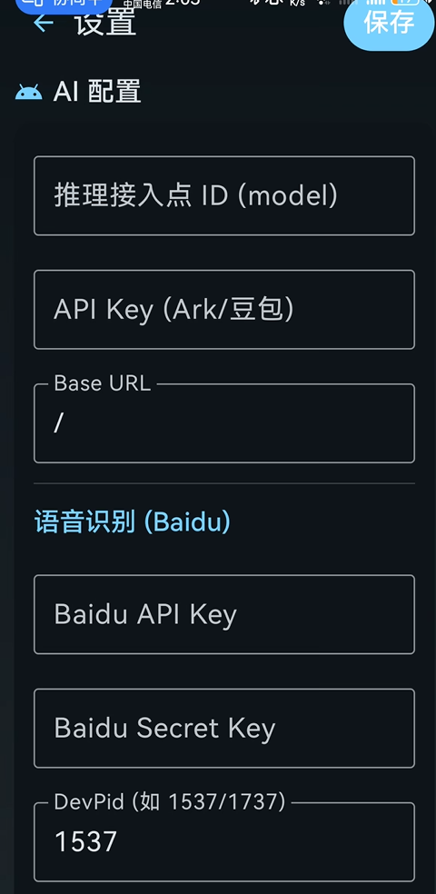
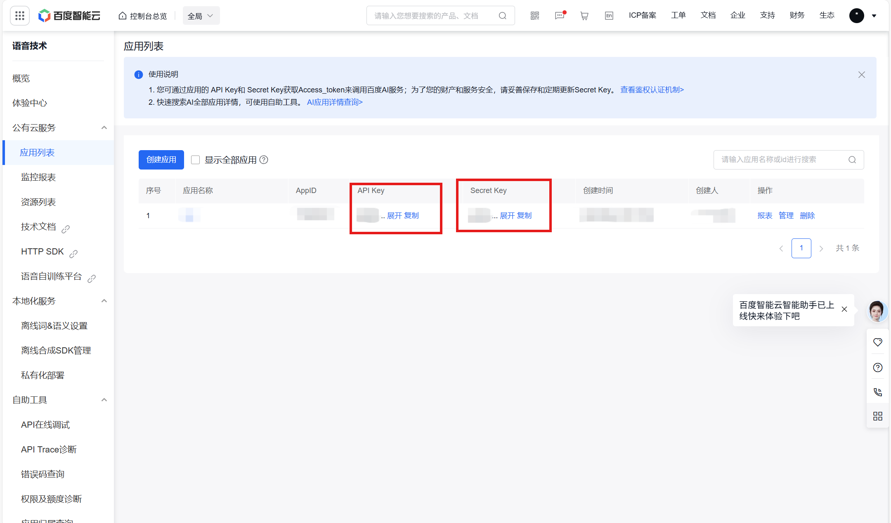
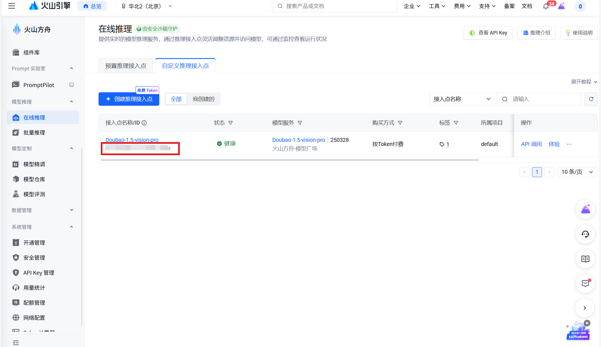
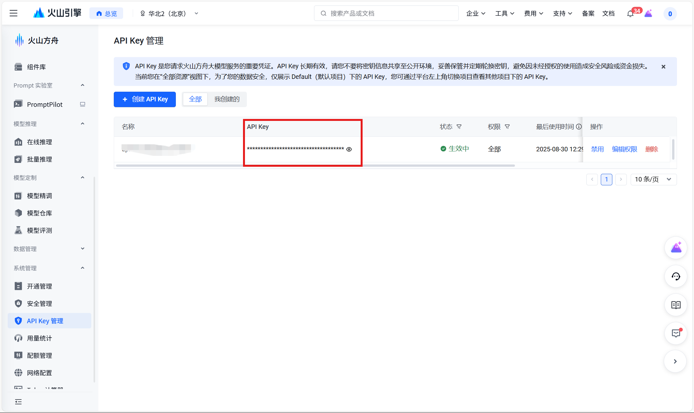

# OpenGlass 智能眼镜 Android 应用

一个专为OpenGlass智能眼镜设计的Android应用，支持语音识别、AI对话、图像分析等功能。

## 🌟 主要功能

- **语音识别**: 支持手机录音和设备录音两种模式
- **AI对话**: 集成豆包AI，支持多轮对话
- **图像分析**: 拍照上传并获取AI分析结果
- **蓝牙连接**: 与OpenGlass设备进行BLE通信
- **TTS播放**: AI回复的语音播放功能

## 🏗️ 技术架构

- **UI框架**: Jetpack Compose
- **架构模式**: MVVM
- **异步处理**: Kotlin Coroutines
- **网络请求**: Retrofit + OkHttp
- **蓝牙通信**: Android BLE API
- **相机集成**: CameraX
- **音频处理**: AudioRecord

## 📱 安装要求

- Android 8.0 (API 26) 或更高版本
- 支持BLE的Android设备
- OpenGlass智能眼镜设备

## 🚀 快速开始

### 1. 克隆项目
```bash
git clone <repository-url>
cd my-app
```

### 2. 配置API密钥
在运行应用之前，需要配置以下API密钥：

#### 豆包AI API配置
1. 访问 [豆包AI官网](https://www.doubao.com/)
2. 注册账号并获取API密钥
3. 在应用设置中填入API密钥

#### 百度语音识别API配置
1. 访问 [百度AI开放平台](https://ai.baidu.com/)
2. 创建应用并开通语音识别服务
3. 获取API Key和Secret Key
4. 在应用设置中填入相关信息

### 3. 编译运行
```bash
./gradlew assembleDebug
```

## ⚙️ API设置指导

### 进入设置界面
1. 打开应用后，点击右上角的设置按钮（⚙️图标）
2. 进入设置界面

### 豆包AI API设置
1. **获取API密钥**：
   - 访问 [豆包AI官网](https://www.doubao.com/)
   - 注册并登录账号
   - 在控制台中找到API密钥

2. **填写设置**：
   - 在"图文API Key"输入框中填入豆包AI的API密钥
   - 点击右上角的"保存"按钮保存设置

### 百度语音识别API设置

#### 步骤1：获取百度AI API信息
1. 访问 [百度AI开放平台](https://ai.baidu.com/)
2. 注册并登录账号
3. 创建新应用：
   - 点击"创建应用"
   - 填写应用名称（如：OpenGlass语音识别）
   - 选择"语音技术"产品
   - 创建应用

4. 开通语音识别服务：
   - 在应用详情页面，找到"语音识别"服务
   - 点击"立即使用"开通服务
   - 记录下API Key和Secret Key

#### 步骤2：在应用中配置API信息
1. **Baidu API Key**: 填入从百度AI平台获取的API Key
2. **Baidu Secret Key**: 填入从百度AI平台获取的Secret Key
3. **DevPid**: 语音识别产品ID
   - 默认值：1537（普通话识别，推荐）
   - 其他选项：
     - 1536: 普通话识别（带标点符号）
     - 1538: 普通话识别（极速版）
     - 1737: 英语识别
     - 1637: 粤语识别
     - 1837: 四川话识别

4. **转发ASR到豆包**: 
   - 开启：语音识别结果会自动发送给豆包AI进行对话
   - 关闭：仅进行语音识别，不进行AI对话

#### 步骤3：保存设置
- 点击右上角的"保存"按钮
- 系统会显示"设置已保存"的提示
- 设置会立即生效，无需重启应用

### 设置界面说明

```
┌─────────────────────────────────────┐
│ 设置                    [保存]      │
├─────────────────────────────────────┤
│ 图文API Key                          │
│ [豆包AI的API密钥]                    │
│                                     │
│ Baidu API Key                       │
│ [百度AI的API Key]                    │
│                                     │
│ Baidu Secret Key                    │
│ [百度AI的Secret Key]                 │
│                                     │
│ DevPid                              │
│ [1537]                              │
│                                     │
│ 转发ASR到豆包 [✓]                   │
└─────────────────────────────────────┘
```

### 详细设置步骤

#### 1. 豆包AI API配置
1. 打开豆包AI官网：https://www.doubao.com/
2. 注册并登录账号
3. 进入控制台，找到API管理
4. 复制API密钥
5. 在应用设置中的"图文API Key"字段粘贴

#### 2. 百度AI API配置
1. 打开百度AI开放平台：https://ai.baidu.com/
2. 注册并登录账号
3. 创建新应用：
   - 应用名称：OpenGlass语音识别
   - 应用描述：OpenGlass智能眼镜语音识别应用
   - 选择产品：语音技术
4. 开通语音识别服务
5. 复制API Key和Secret Key
6. 在应用设置中填入相应字段

#### 3. DevPid参数选择
- **1537**（推荐）：普通话识别，适合大多数用户
- **1536**：普通话识别（带标点符号），适合需要标点的场景
- **1538**：普通话识别（极速版），识别速度更快
- **1737**：英语识别，适合英语语音输入
- **1637**：粤语识别，适合粤语用户
- **1837**：四川话识别，适合四川话用户

#### 4. 转发设置
- **开启转发**：语音识别结果会自动发送给豆包AI进行对话，适合需要AI回复的场景
- **关闭转发**：仅进行语音识别，不进行AI对话，适合仅需要文字转换的场景

### 验证设置
1. **豆包AI验证**：
   - 在聊天界面发送一条消息
   - 如果收到AI回复，说明豆包AI配置正确

2. **百度语音识别验证**：
   - 点击录音按钮进行语音输入
   - 如果语音被正确识别为文字，说明百度API配置正确

### 常见设置问题

#### 1. API Key格式问题
- 确保API Key没有多余的空格
- 检查是否完整复制了API Key
- 确认API Key没有过期

#### 2. 设置保存失败
- 检查网络连接
- 重新输入API信息
- 重启应用后重试

#### 3. 设置不生效
- 确认点击了"保存"按钮
- 检查是否显示了"设置已保存"提示
- 重启应用验证设置

### 设置截图参考

详细的设置界面截图如下：

- **主设置界面**：
  

- **百度API配置界面**：
  

- **豆包API配置界面（1）**：
  

- **豆包API配置界面（2）**：
  

## 📖 使用指南

### 基本操作
1. **连接设备**: 确保OpenGlass设备已开启并处于可发现状态
2. **开始对话**: 点击录音按钮开始语音输入
3. **查看回复**: AI回复会显示在聊天界面中
4. **拍照分析**: 使用设备拍照功能获取图像分析

### 录音模式
- **手机录音**: 使用手机麦克风进行录音
- **设备录音**: 使用OpenGlass设备的麦克风（需要蓝牙连接）

### 设置选项
- **API配置**: 配置各种AI服务的API密钥
- **转发设置**: 控制语音识别结果是否转发给AI对话

## 🔧 故障排除

### 常见问题

#### 1. API Key无效
**症状**: 应用提示"API Key无效"或"401 Unauthorized"
**解决方案**:
- 检查API密钥是否正确填写（注意大小写）
- 确认API密钥是否有效且未过期
- 检查网络连接是否正常
- 确认API服务是否已开通

#### 2. 语音识别失败
**症状**: 录音后没有识别结果或识别结果为空
**解决方案**:
- 确认百度API配置是否正确
- 检查网络连接
- 尝试调整录音音量
- 确认DevPid设置是否正确

#### 3. 蓝牙连接失败
**症状**: 无法连接OpenGlass设备
**解决方案**:
- 确保设备已开启蓝牙
- 检查OpenGlass设备是否处于可发现状态
- 重启应用和设备
- 检查设备电量是否充足

#### 4. 拍照功能异常
**症状**: 设备拍照后没有图像数据
**解决方案**:
- 确认设备已正确连接
- 检查相机权限是否已授予
- 重启应用
- 检查设备相机是否正常工作

### 日志查看
应用使用以下前缀的日志进行调试：
- `[AUDIO_REC]`: 录音相关
- `[AUDIO_UPLOAD]`: 音频上传
- `[ASR_BAIDU]`: 百度语音识别
- `[ASR_DEV]`: 设备录音识别
- `[PHOTO_PREVIEW]`: 照片预览

### 调试步骤
1. 打开Android Studio的Logcat
2. 过滤日志前缀（如`[ASR_BAIDU]`）
3. 执行相关操作
4. 查看日志输出，定位问题

## 📁 项目结构

```
app/src/main/java/com/example/myapp/
├── ui/
│   ├── chat/
│   │   └── ChatScreen.kt          # 主聊天界面
│   └── settings/
│       └── SettingsScreen.kt      # 设置界面
├── data/
│   ├── network/
│   │   └── AiApi.kt              # AI API接口
│   └── repository/
│       └── AiRepository.kt       # AI服务仓库
├── input/
│   └── ble/
│       └── BleInput.kt           # 蓝牙输入处理
├── settings/
│   └── Settings.kt               # 设置管理
└── ChatViewModel.kt              # 聊天视图模型
```

## 🤝 贡献指南

1. Fork 项目
2. 创建功能分支 (`git checkout -b feature/AmazingFeature`)
3. 提交更改 (`git commit -m 'Add some AmazingFeature'`)
4. 推送到分支 (`git push origin feature/AmazingFeature`)
5. 打开 Pull Request

## 📄 许可证

本项目采用 MIT 许可证 - 查看 [LICENSE](LICENSE) 文件了解详情

## 📞 联系方式

如有问题或建议，请通过以下方式联系：
- 提交 Issue
- 发送邮件至 [your-email@example.com]

## 🙏 致谢

- [OpenGlass项目](https://github.com/openglass) - 硬件设计
- [豆包AI](https://www.doubao.com/) - AI对话服务
- [百度AI](https://ai.baidu.com/) - 语音识别服务
- [Jetpack Compose](https://developer.android.com/jetpack/compose) - UI框架
